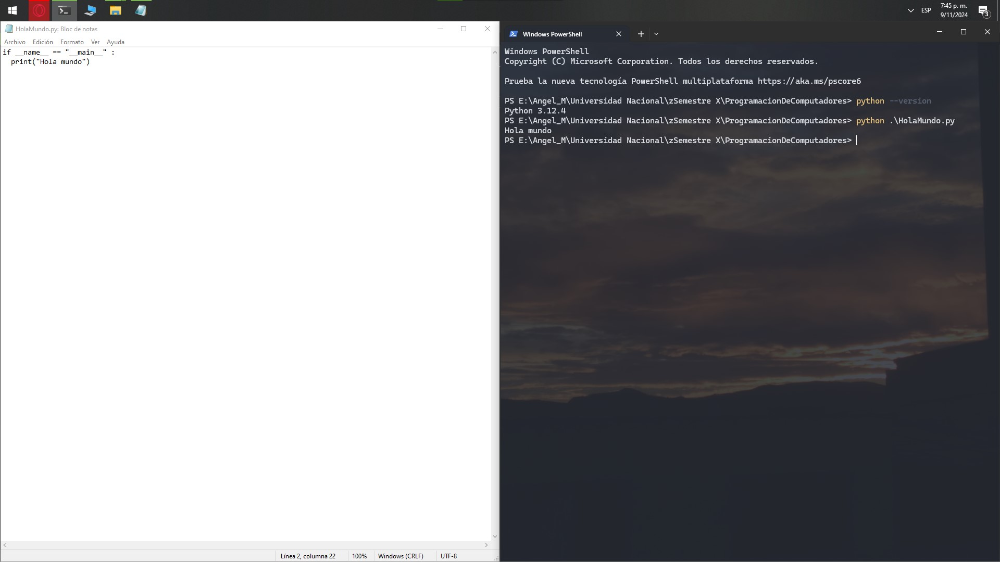
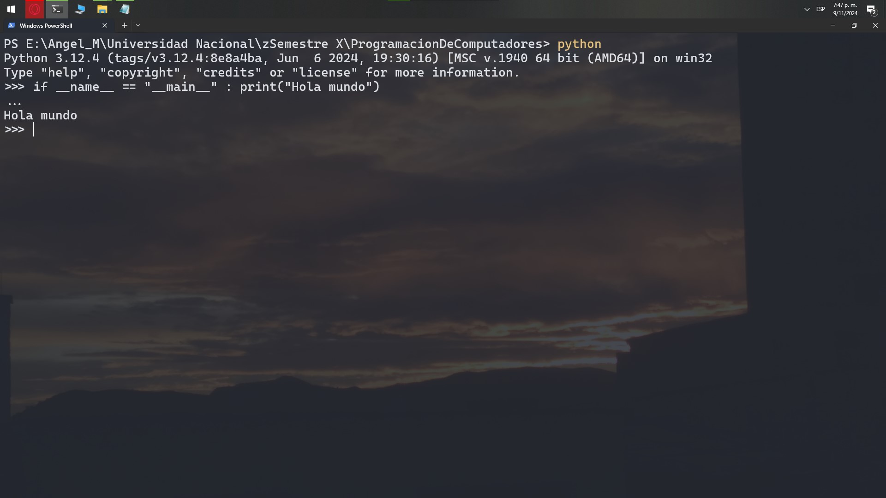
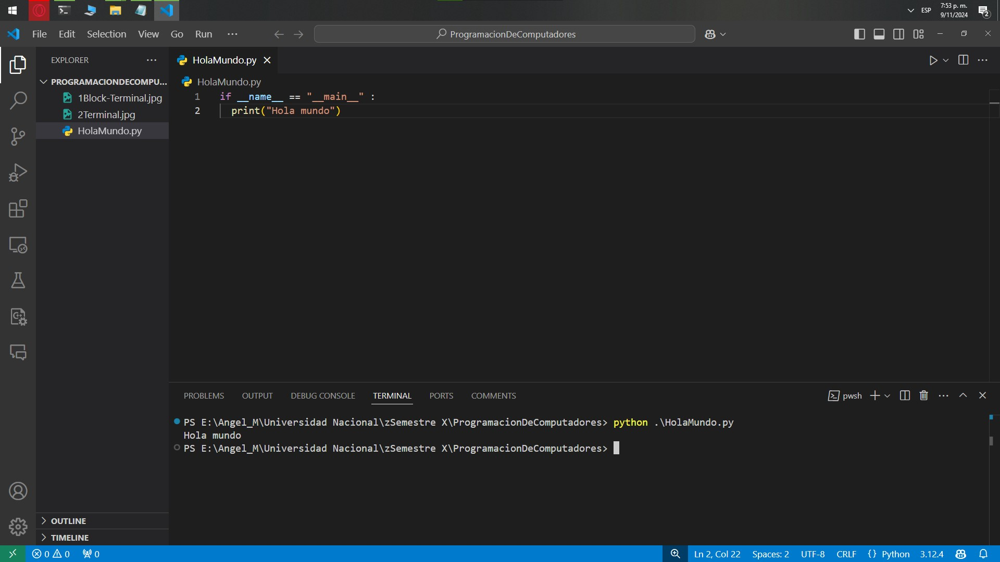

# pdc_unal_1HalloWelt

Este repositorio demuestra tres métodos distintos para ejecutar un programa básico en Python que imprime "Hola Mundo". El código a ejecutar se muestra a continuación:

```python
if __name__ == "__main__" :
  print("Hola mundo")
```

### 1. Usando un block de notas y ejecutando el archivo desde la terminal

Abrimos un edior de texto como el **Bloc de Notas** que tiene Windows por defecto, pegamos el código y guardamos el archivo como HolaMundo.py, luego lo ejecutamos usando la terminal:



### 2. Usando el interprete de Python directamente 

Abrimos la terminal, en este caso **PowerShell** de Windows, y ejecutamos allí el interprete de Python que previamente instalamos, luego pegamos el código y lo ejecutamos allí:



### 3. Usando un IDE como Visual Studio Code

Abrimos **Visual Studio Code**, creamos un nuevo archivo, pegamos el código y guardamos el archivo como HolaMundo.py. Luego, ejecutamos el archivo directamente desde la terminal integrada en el IDE:




